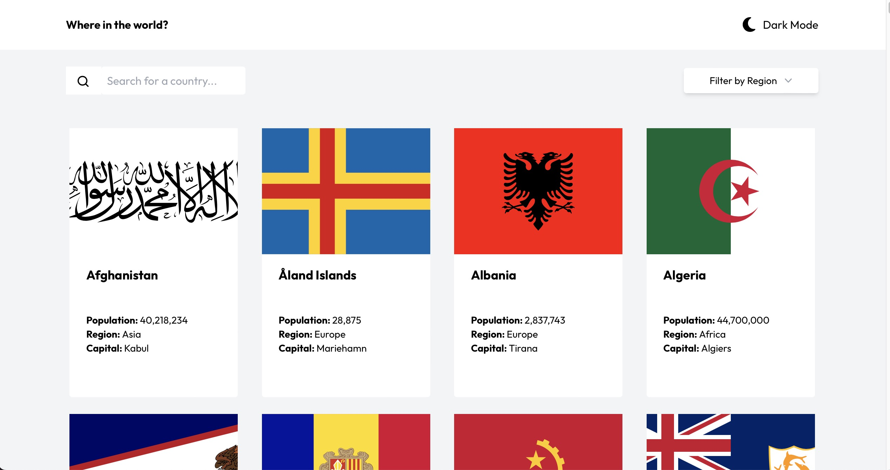
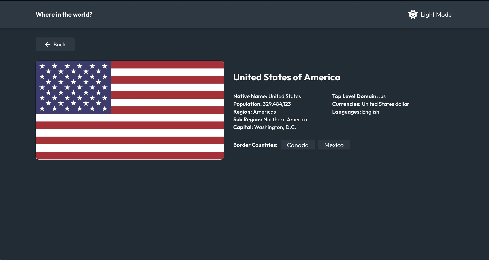

# Country Search - Discover and Learn About Countries Worldwide

Country Search is a React-based web application designed for users to explore and learn about countries around the world. With a clean and intuitive user interface, users can seamlessly search for specific countries, filter them by regions, and access comprehensive details such as population, languages, and more.

## Key Features

- **Search Functionality:** Quickly find information about a specific country by using the search feature.
- **Region Filtering:** Filter countries based on regions, making it easier to explore specific parts of the world.
- **Detailed Information:** View detailed information about each country, including population, languages spoken, and more.
- **Responsive Design:** Ensures a seamless experience across various devices.
- **Dark Mode:** Easily toggle between Light and Dark modes.

## Screenshots

## Technologies Used

- React
- React Router
- Tailwind
- REST Countries API (<https://restcountries.com>)
